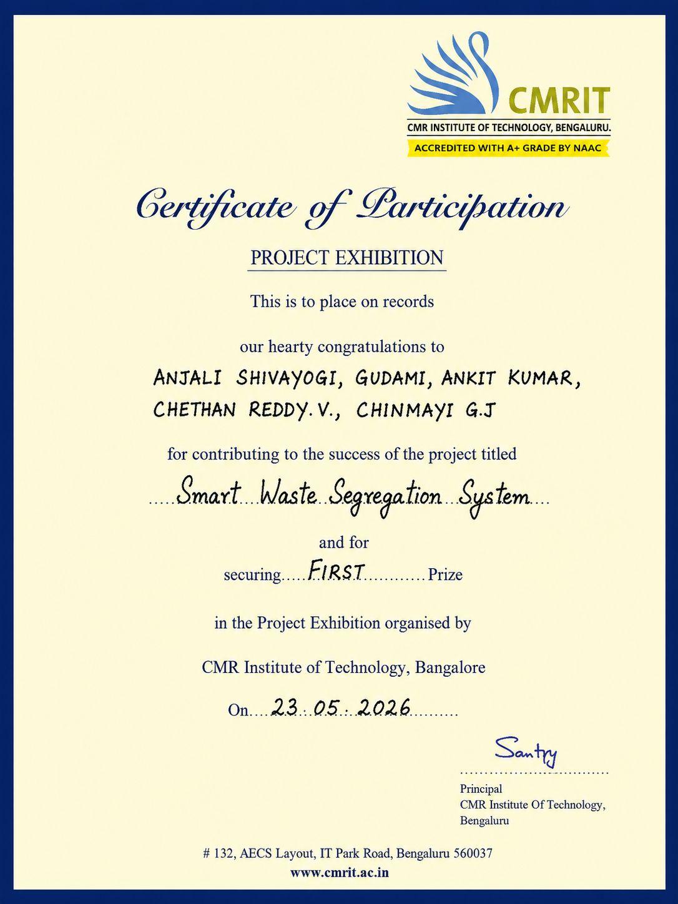

# Smart Waste Segregation System

## Overview
The **Smart Waste Segregation System** is an IoT-based mini project developed to automatically separate waste into different categories such as **wet, dry, and metal waste** using sensors and a microcontroller. The system reduces manual effort, improves recycling efficiency, and promotes a cleaner environment.

This project was developed as part of the **Innovation & Design Thinking Laboratory** under **Visvesvaraya Technological University (VTU)**.

---

## Objectives

- Automate the waste segregation process.
- Reduce manual handling of waste.
- Improve recycling efficiency.
- Promote environmental sustainability.
- Support smart city waste management.

---

## Technologies Used

- Arduino UNO
- Embedded C / Arduino IDE
- Ultrasonic Sensor
- Moisture Sensor
- Servo Motor
- Breadboard & Jumper Wires
- Power Supply

---

## Hardware Components

- Arduino UNO
- HC-SR04 Ultrasonic Sensor
- Moisture Sensor
- Servo Motor
- Breadboard
- Jumper Wires
- Waste Collection Bin
- Power Supply

---

## Working Principle

1. Waste is placed into the system.
2. The Ultrasonic Sensor detects the waste.
3. The Moisture Sensor identifies whether the waste is wet or dry.
4. The Arduino processes the sensor data.
5. The Servo Motor rotates and directs the waste into the correct compartment.
6. The system resets and waits for the next waste item.

---

## Features

- Automatic waste detection
- Wet and dry waste segregation
- Low-cost implementation
- Easy to build
- Eco-friendly solution
- Suitable for educational purposes

---

## Advantages

- Reduces human effort
- Improves cleanliness
- Encourages recycling
- Cost-effective
- Easy maintenance
- Environment friendly

---

## Future Enhancements

- AI-based waste classification
- Computer Vision for object recognition
- IoT monitoring using ESP32
- Mobile application integration
- Smart fill-level detection
- Cloud data storage
- Solar-powered operation

---

## Repository Contents

- Final Project Report (PDF)
- README

---

## Institution

**CMR Institute of Technology (CMRIT), Bengaluru**

Affiliated to **Visvesvaraya Technological University (VTU)**

---

## Project Report

The complete project report is available in this repository as:

**final report.pdf**

---

## Conclusion

The Smart Waste Segregation System demonstrates how IoT and embedded systems can improve waste management through automation. It provides an efficient, hygienic, and eco-friendly solution for waste segregation and serves as a strong foundation for future smart city applications.

## Achievement

This project was awarded **First Prize** in the **Project Exhibition** organized by **CMR Institute of Technology (CMRIT), Bengaluru** on **23 May 2026**.

The project was recognized for its innovative approach to developing an IoT-based Smart Waste Segregation System.

### Award Certificate

